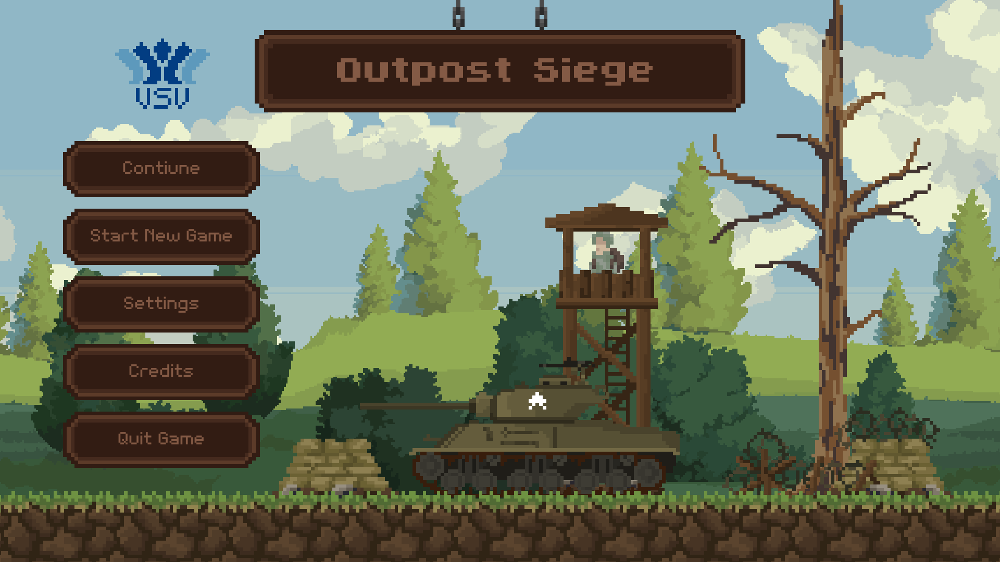
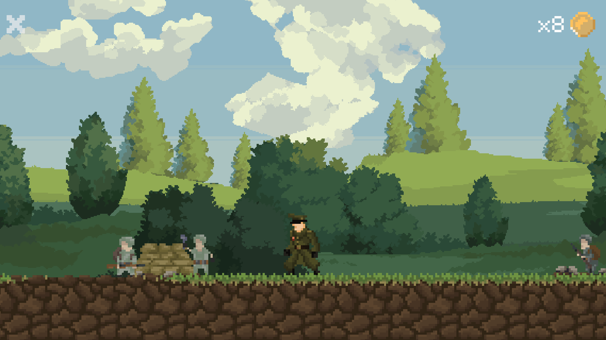
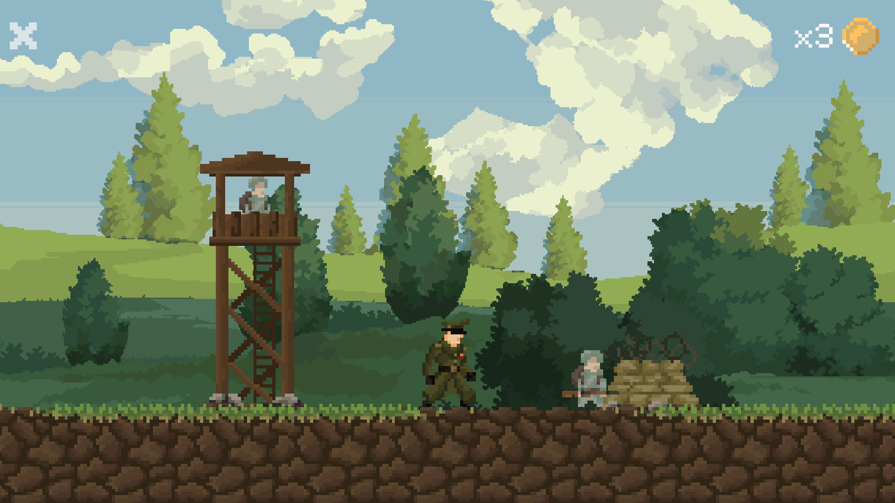
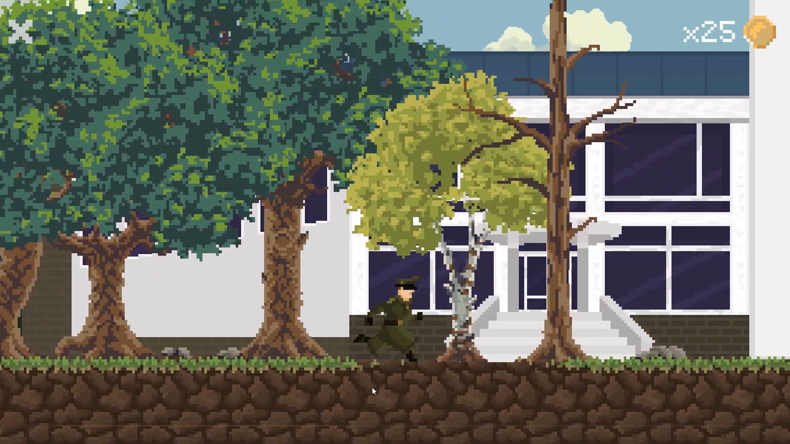
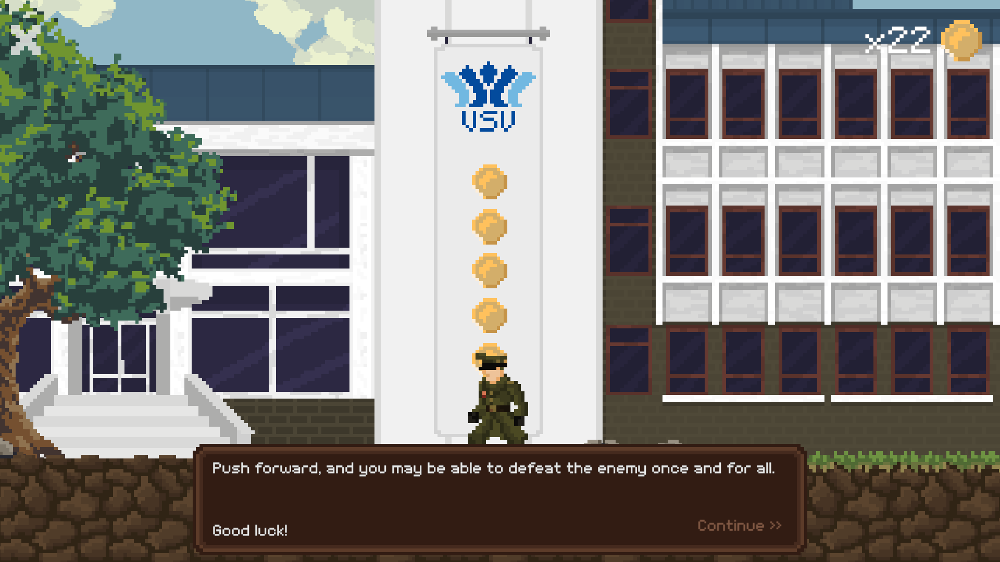
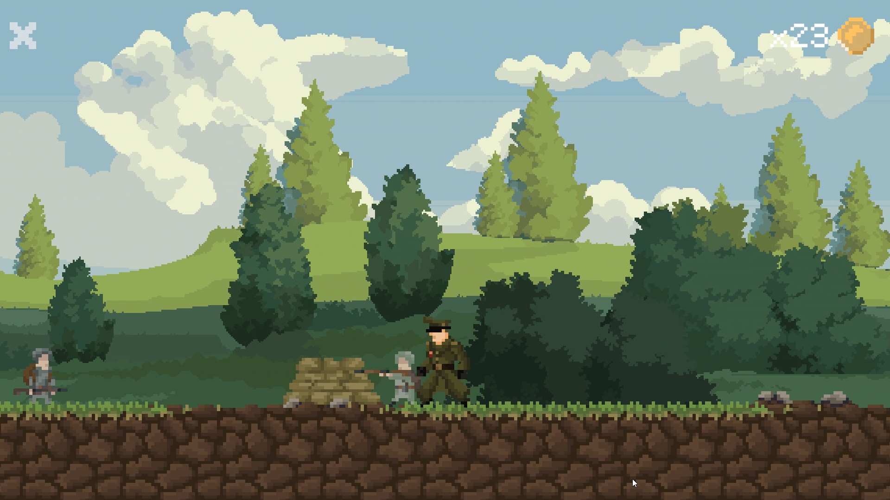
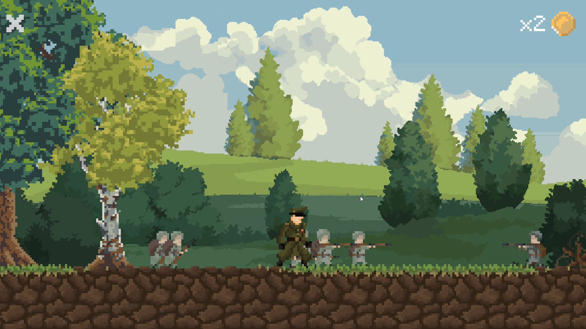

# Outpost Siege

### 2D Strategy and Base Defense Game

Outpost Siege is a 2D strategy and base defense prototype developed in Unity,
set in a World War II-inspired environment.

Command an isolated outpost behind enemy lines. Explore the surrounding
territory, manage a limited supply of coins, recruit units, and build defenses
against increasingly large enemy waves. Recover a research building to unlock
further upgrades and coordinate attacks on enemy bases.

## Gameplay Demonstration

  

  <a href="https://youtu.be/ESxV5ebcrsg">
    <strong>Watch the prototype gameplay</strong>
  </a>

## Download

[Download the Windows prototype](../../releases)

Download `OutpostSiege-v0.1b-Windows-NoSound.zip` from the release assets,
extract the entire archive, and launch the game executable.

## Gameplay

The commander directs the outpost's development and military operations.
Although unable to shoot, the commander can take damage and die, making
positioning and protection important during exploration and combat.

Coins fund recruitment, construction, resource gathering, and upgrades.
Carrying capacity is limited, so spending and collecting resources must be
planned carefully.

The current prototype includes:

- Procedural terrain variation and randomized research building placement
- Coin collection with limited carrying capacity
- Infantry and engineer recruitment
- Tree harvesting performed by engineers
- Defensive walls, watchtowers, and construction upgrades
- Research-based access to additional upgrades and attack commands
- Enemy waves that increase in size over time
- Destructible enemy bases on both sides of the map

## Units and Roles

| Unit | Role |
| --- | --- |
| Commander | Explores, spends coins, and coordinates construction and attacks. Cannot shoot and must avoid taking fatal damage. |
| Engineer | Builds structures and cuts marked trees, which can drop coins. |
| Infantry | Moves to the nearest wall, takes a defensive position, and fires at detected enemies. Advances toward an enemy base when ordered to attack. |
| Tower Sniper | Provides defensive fire from a watchtower. |

## Construction and Resources

Spend coins to commission construction, recruit units, and mark trees for
harvesting. Engineers carry out the work, and harvested trees can return coins
to support further expansion.

Walls provide defensive positions for infantry, while watchtowers support the
defensive line with sniper fire.

  
  

## Exploration and Research

The research building can appear on either side of the starting position.
Finding and unlocking it grants access to additional construction upgrades
and the command menu used to launch attacks.

The current prototype represents this objective with a university building.

  
  

## Defense and Offensives

Enemy waves arrive at timed intervals and grow in size as the game progresses.
Infantry defends from nearby walls and engages enemies within detection range.

After unlocking the research building, use the command menu to send troops
toward the left or right enemy base. Each base has its own health and can be
destroyed through sustained attacks. Destroy both bases to win.

  
  

## Controls

| Key | Action |
| --- | --- |
| W / A / S / D | Move the commander |
| Space | Interact with nearby objects and spend coins |
| M | Open the attack command menu after unlocking the research building |
| Esc | Pause the game |

## Development

Inspired by the resource management and base defense mechanics of
Kingdom: Two Crowns, Outpost Siege explores a military setting built around
unit coordination, fortifications, and research progression.

| Area | Tools |
| --- | --- |
| Game engine | Unity 6 |
| Programming | C# |
| Original pixel art and animation | Aseprite |
| Platform | Windows PC |

## Project Status

Outpost Siege is a playable prototype. Planned additions include more
strategic buildings, expanded technology progression, and further vehicle
gameplay.

Some environmental sprites are temporary third-party placeholders awaiting
replacement with original artwork.

This repository showcases the game through screenshots and gameplay footage.
The Unity source project and original asset files are not publicly distributed.
