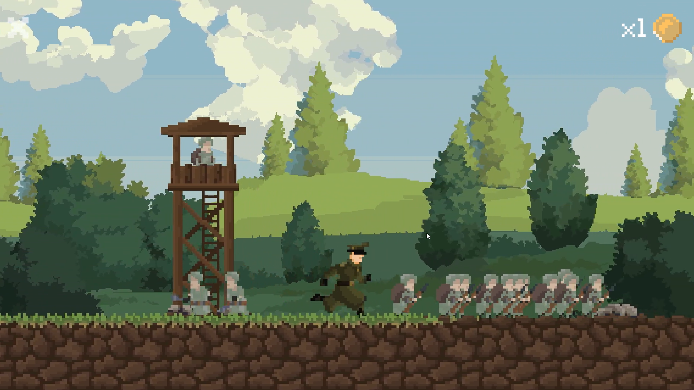

# Outpost Siege

### 2D Strategy and Base Defense Game

Outpost Siege is a 2D strategy and base defense game developed in Unity,
set in a World War II-inspired environment.

Take command of an isolated outpost behind enemy lines. Explore the surrounding
territory, gather resources, recruit troops, and build defenses while holding
off recurring enemy attacks. Recover a strategic research building to unlock
stronger fortifications and prepare an offensive against enemy bases.

  

## Gameplay

Coins support recruitment, construction, and upgrades. Expanding the outpost
requires balancing exploration and spending with preparations for the next
attack.

- Procedural terrain variation and randomized research building placement
- Resource collection and management
- Infantry and engineer recruitment
- Defensive walls, watchtowers, and construction upgrades
- Enemy waves that grow in size over time
- Research-based progression
- Victory through the destruction of both enemy bases

## Building the Outpost

Recruit engineers to construct and improve defenses. Establish walls and
watchtowers, position your forces, and strengthen the outpost before advancing.

  
  

## Exploration and Research

The research building can appear on either side of the starting position.
Finding and recovering it unlocks additional fortification upgrades, giving
exploration a direct role in the outpost's development.

The current prototype uses a university building as the research objective.

  
  

## Combat and Defense

Defend against recurring attacks while assembling a force capable of pushing
into enemy territory. Destroy the enemy bases on both sides of the map to
complete the scenario.

  
  

## Development

Inspired by the resource management and defensive progression of
Kingdom: Two Crowns, Outpost Siege adapts these ideas to a military setting
with infantry recruitment, fortifications, and research objectives.

| Area | Tools |
| --- | --- |
| Game engine | Unity 6 |
| Programming | C# |
| Original pixel art and animation | Aseprite |
| Platform | Windows PC |

## Project Status

Outpost Siege is a playable prototype. Planned additions include more
strategic buildings, expanded technology progression, and further vehicle
gameplay.

Some environmental sprites are temporary third-party placeholders awaiting
replacement with original artwork.

This repository is a showcase of the game. Source code and game assets are
not publicly distributed.
